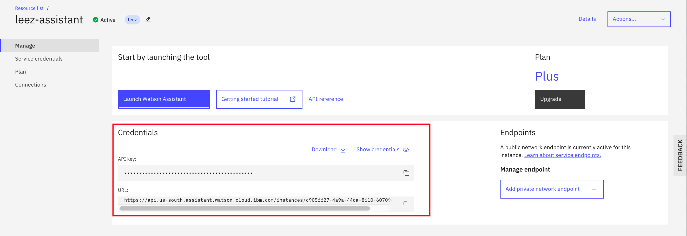
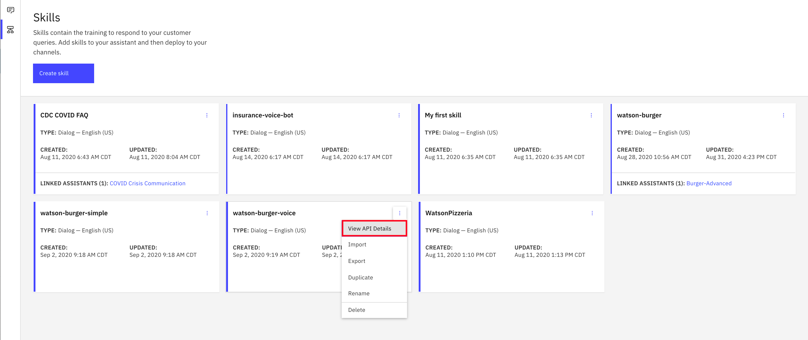
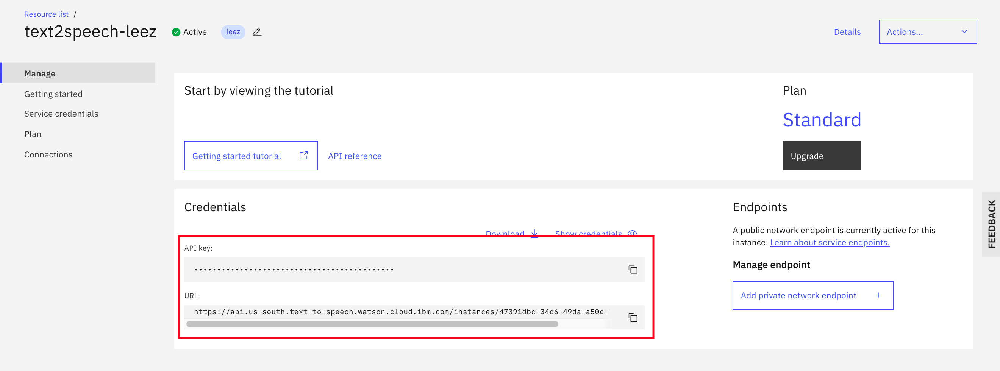
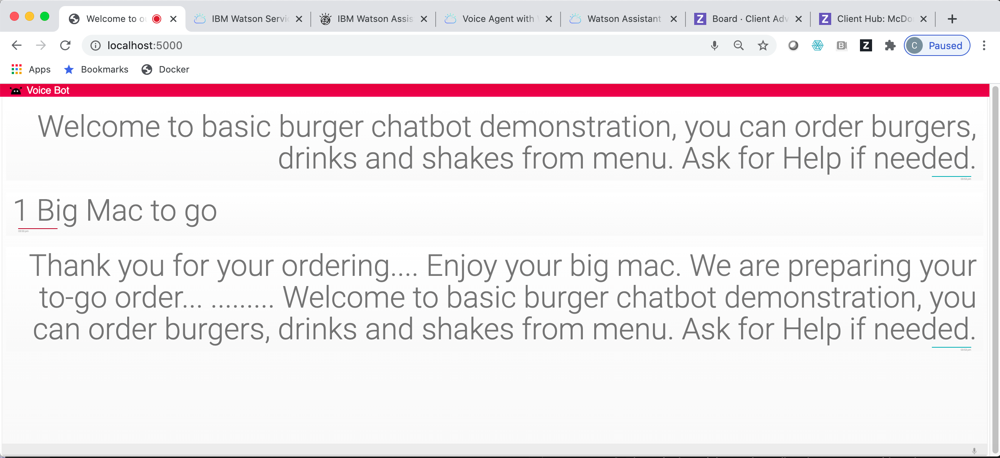

# Voice-Enabled Chatbot with Watson Services

This repo introduces a sample Python application that voice-enables a Watson chatbot. You speak to the bot when you order burgers and drinks, `Watson Speech to Text` service transcribes the audio stream to text and pass the messages to `Watson Assistant` service. The `Watson Assistant` analyzes and processes the inquiry, and responses based on its dialog flow logic. Finally, the messages from the bot is passed to `Watson Text to Speech` service which converts the text messages to audio format and delivers back to you.

The web application itself is built on top of JQuery and Python Flask. When you complete the exercise, you will understand how to:

* Make a Watson Speech To Text call using a Web Socket Connection
* Make a Watson Text to Speech REST API call
* Send and receive messages to Watson Assistant using REST APIs
* Integrate Watson Speech To Text, Watson Text To Speech and Watson Assistant in a web app


Adopted from IBM code pattern [Create a web based chatbot with voice input and output](https://github.com/IBM/watson-voice-bot).

This repo is part of Watson chatbot serial. The entire serial includes
* [Simple ChatBot](https://github.com/lee-zhg/watson-chatbot-simple.git)
* [Dressed-up ChatBot](https://github.com/lee-zhg/watson-chatbot-advanced.git)
* [Voice-Enabled ChatBot](https://github.com/lee-zhg/watson-voice-enabled-chatbot.git)
* [VoiceBot – Call and speak to ChatBot](https://github.com/lee-zhg/watson-voicebot.git)


## Use Case Flow

1. User selects the microphone option on the browser and speaks.
2. The voice is passed on to Watson Speech To Text using a Web Socket connection.
3. The text from Watson Speech to Text is extracted and sent as input to Watson Assistant.
4. The response from Watson Assistant is passed onto Watson Text to Speech.
5. The audio output is sent to the web application and played back to the user, while the UI also displays the same text.


## Included components

* [Watson Speech-to-Text](https://www.ibm.com/watson/services/speech-to-text/): A service that converts human voice into written text.
* [Watson Text-to-Speech](https://www.ibm.com/watson/services/text-to-speech/): Converts written text into natural sounding audio in a variety of languages and voices.
* [Watson Assistant](https://www.ibm.com/watson/ai-assistant/): Create a chatbot with a program that conducts a conversation via auditory or textual methods.


## Featured technologies

* [Flask](http://flask.pocoo.org/): Python is a programming language that lets you work more quickly and integrate your systems more effectively.
* [jQuery](https://jquery.com/): It is a cross-platform JavaScript library designed to simplify the client-side scripting of HTML.


## Exercise Flow


### Step 1 - Clone the Repo

In a terminal, run:

```
$ git clone https://github.com/lee-zhg/watson-voice-enabled-chatbot.git

$ cd watson-voice-enabled-chatbot
```

We’ll be using the file [`data/skill-watson-burger-voice.json`](../../data/skill-watson-burger-voice.json) to upload the Assistant Intents, Entities, and Dialog Nodes.


### Step 2 - Create Watson Assistant Service

`Watson Assistant` is the core component of the chatbot. Its intents, entities and dialog flows' configurations determine the covered subjects and conversation flows.

If you have an existing `Watson Assistant` service, you may skip the rest of the section.

To create an instance of `Watson Assistant` service,

1. Login to [IBM Cloud](https://cloud.ibm.com).

1. Navigate to `Watson Assistant` catalog page (https://cloud.ibm.com/catalog/services/conversation).

1. Select `Lite`, `Plus Trial` or `Plus` plan.

1. Give a unique name.

1. Click `Create` button on the right.

1. Go to the `Manage` tab.

1. Record the service `API key` and `URL`.

    


### Step 3 - Configure Watson Assistant

You define `intents`, `entities` and `dialog flows` in your `Watson Assistant` instance. You may develop from scratch or import file [`data/skill-watson-burger-voice.json`](../../data/skill-watson-burger-voice.json) as a starting point.

1. Go to the `Manage` tab of your `Watson Assistant` instance and then click on `Launch Watson Assistant`.

1. Select the `Skills` tab in the left navigation tab.

1. Click `Create skill`

1. Select the `Dialog skill` option and then click `Next`.

1. Go to the `Import skill` tab.

1. Click the link `Drag and drop file here or click to select a file`.

1. Go to your cloned repo dir, and `Open` file [`data/skill-watson-burger-voice.json`](../../data/skill-watson-burger-voice.json).

1. Click `Import`.

1. Click `Skills` tab on the left. A list of available `skills` show up in the right window.

    

1. Select the 3 vertical dots on the `watson-burger-voice` tile and choose `View API Details`.

1. Record the `Skill ID`.

Before you continue the rest of the exercise, you must have
* an instance of `Watson Assistant` service
* a skill `watson-burger-voice` defined in the above service


### Step 4 - Create Watson Speech to Text Service

`Watson Speech to Text` service takes the voice stream of the end users' input and transcribes to text which is subsequently passed to `Watson Assistant` service as a question or request to be fulfilled.

If you have an existing `Watson Speech to Text` service, you may record its `API key` and `URL`, and skip the rest of the section.

To create an instance of `Watson Speech to Text` service,

1. Login to [IBM Cloud](https://cloud.ibm.com).

1. Navigate to `Watson Speech to text` catalog page (https://cloud.ibm.com/catalog/services/speech-to-text).

1. Select `Lite` or `Standard` plan.

1. Give a unique name.

1. Click `Create` button on the right.

1. Go to the `Manage` tab.

1. Record the service `API key` and `URL`.

    


### Step 5 - Create Watson Text to Speech Service

`Watson Text to Speech` service converts text messages from `Watson Assistant` service to audio, and then send back to the end user who initiated the call. 

If you have an existing `Watson Text to Speech` service, you may record its `API key` and `URL`, and skip the rest of the section.

To create an instance of `Watson Text to Speech` service,

1. Login to [IBM Cloud](https://cloud.ibm.com).

1. Navigate to `Watson Text to Speech` catalog page (https://cloud.ibm.com/catalog/services/text-to-speech).

1. Select `Lite` or `Standard` plan.

1. Give a unique name.

1. Click `Create` button on the right.

1. Go to the `Manage` tab.

1. Record the service `API key` and `URL`.

    


### Step 6 - Configure `.env` Fle

File `.env` is used to store connection information of Watson services in the sample application. 

1. You create `.env` file by copying the [`sample.env`](sample.env) file. File `sample.env` locates at the root folder of the cloned repo.

    ```bash
    cp sample.env .env
    ```

1. Open the .env file in a file editor.

1. Update the `API key` and `URL` for each serviice. If you did not record their value in the previous sections, go back to the sections and retrieve values.

    ```
    # Watson Speech to Text
    SPEECH_TO_TEXT_APIKEY=
    SPEECH_TO_TEXT_URL=

    # Watson Text to Speech
    TEXT_TO_SPEECH_APIKEY=
    TEXT_TO_SPEECH_URL=

    # Watson Assistant
    ASSISTANT_APIKEY=
    ASSISTANT_URL=
    ```

1. Change the line below

    ```
    #WORKSPACE_NAME=
    ```

    to 

    ```
    WORKSPACE_NAME=watson-burger-voice
    ```

1. Below is a sample `.env` file.

    ```bash
    # Copy this file to .env before starting the app.
    # Replace the credentials with your own.

    # Watson Speech to Text
    SPEECH_TO_TEXT_APIKEY=W0UsAxM5-me6Xbm2p9GPSjzL3NLLDVUGrI-jyUSDdw
    SPEECH_TO_TEXT_URL=https://api.us-south.speech-to-text.watson.cloud.ibm.com/instances/ba8aae8-3bc9-4da4-9b3f-eb18d018de

    # Watson Text to Speech
    TEXT_TO_SPEECH_APIKEY=LfC_4SIUtBKQvE6zUCdbiv0bzBeOckjWjMoUndZ_B
    TEXT_TO_SPEECH_URL=https://api.us-south.text-to-speech.watson.cloud.ibm.com/instances/4731dbc-34c6-49da-a50c-7e0cc53f79

    # Watson Assistant
    ASSISTANT_APIKEY=7JcZF4BqyX67echU9OrArQTYo4XzjMX1WsiTQo2o1
    ASSISTANT_URL=https://api.us-south.assistant.watson.cloud.ibm.com/instances/c905f27-4a9a-44ca-8610-60704de1b7

    # Optionally, use a non-default skill by specifying your own workspace ID or name.
    # WORKSPACE_ID=d48f1116-8093-4f56-b195-46dcccf92a0a
    WORKSPACE_NAME=watson-burger-voice
    ```

### 7. Run the application

The sample application requires Python 3.5 and above. It has been tested with Python 3.8.0 om Mac OS with Google Chrome browser. 

The general recommendation for Python development is to use a virtual environment ([venv](https://docs.python.org/3/tutorial/venv.html)). 

1. Create a virtual environment using Python. Use the proper `Python` command depending on your Python version.

    > Note: `python` may be named `python3` or `python3.8` on your system.

    ```bash
    python3 -m venv mytestenv
    ```

1. Now source the virtual environment. Use one of the two commands depending on your OS.

    ```bash
    source mytestenv/bin/activate  # Mac or Linux
    ```

    ```
    ./mytestenv/Scripts/activate   # Windows PowerShell
    ```

    > **TIP** :bulb: To terminate the virtual environment use the `deactivate` command.

1. Start the app by running:

    ```bash
    pip3 install -r requirements.txt
    python3 app.py
    ```

1. If you have Python v3.8, the sample commands may look like

    ```
    python3.8 -m venv mytestenv
    source mytestenv/bin/activate
    pip3.8 install -r requirements.txt
    python3.8 app.py
    ```

1. Launch a browser and navigate to [http://localhost:5000](http://localhost:5000)

1. Click on the microphone icon to begin speaking your order. Click it again when you finish the sentence.


### Step 8 - Order your Food

Below are couple of sample orders that should work out of the box. The sample application accepts the audio input, processes the order, and delivers the response in both audio and written format.

#### Order #1

1. Start the sample application.

1. The voice-enabled chatbot speaks welcome greeting.

1. Click the microphone to start audio input. The microphone icon locates at the bottom-right corner of the browser.

1. Make the order by speaking `one big mac to go`.

1. Click the microphone to stop audio input.

1. Because all required information to order a burger has been provided, the voice-enabled chatbot grabs information and completes the order with response messages.



#### Order #2

1. Start the sample application.

1. The voice-enabled chatbot speaks welcome greeting.

1. Click the microphone to start audio input.

1. Make the order by speaking `one big mac please`.

1. Click the microphone to stop audio input. The microphone icon locates at the bottom-right corner of the browser.

1. Because dining location information to order a burger was not provided, the voice-enabled chatbot prompts you for the information.

1. After receiving all required information, the voice-enabled chatbot completes the order with response messages.

#### Order #3

1. Start the sample application.

1. The voice-enabled chatbot speaks welcome greeting.

1. Click the microphone to start audio input. The microphone icon locates at the bottom-right corner of the browser.

1. Make the order by speaking `I like to order a small McFlurry with cooky`.

1. Click the microphone to stop audio input.

1. Because all required information to order a McFlurry has been provided, the voice-enabled chatbot grabs information and completes the order with response messages.


## Links

* [Watson Node.js SDK](https://github.com/watson-developer-cloud/node-sdk)
* [Relevancy Training Demo Video](https://www.youtube.com/watch?v=8BiuQKPQZJk)
* [Relevancy Training Demo Notebook](https://github.com/akmnua/relevancy_passage_bww)

## Learn more

* **Artificial Intelligence Code Patterns**: Enjoyed this Code Pattern? Check out our other [AI Code Patterns](https://developer.ibm.com/technologies/artificial-intelligence/).
* **AI and Data Code Pattern Playlist**: Bookmark our [playlist](https://www.youtube.com/playlist?list=PLzUbsvIyrNfknNewObx5N7uGZ5FKH0Fde) with all of our Code Pattern videos
* **With Watson**: Want to take your Watson app to the next level? Looking to utilize Watson Brand assets? [Join the With Watson program](https://www.ibm.com/watson/with-watson/) to leverage exclusive brand, marketing, and tech resources to amplify and accelerate your Watson embedded commercial solution.

## License
This code pattern is licensed under the Apache Software License, Version 2.  Separate third party code objects invoked within this code pattern are licensed by their respective providers pursuant to their own separate licenses. Contributions are subject to the [Developer Certificate of Origin, Version 1.1 (DCO)](https://developercertificate.org/) and the [Apache Software License, Version 2](https://www.apache.org/licenses/LICENSE-2.0.txt).

[Apache Software License (ASL) FAQ](https://www.apache.org/foundation/license-faq.html#WhatDoesItMEAN)
